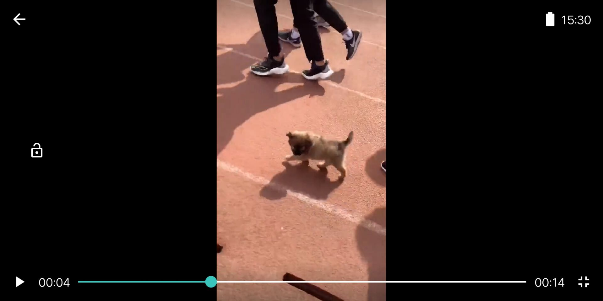

# 段子乐

> 红岩网校暑期考核

# app主要功能介绍

未登陆的个人主页

登陆界面

首页文章列表

我喜欢的段子

个人主页

# 使用的主要技术

## RxJava

使用的郭神封装的拓展函数，使用`RxJava`更加的方便了，切换线程操作符就很常规，放到`io`线程去请求数据，发送数据时切换到主线程，下游就在主线程接收数据，切换线程更加方便。`.mapOrThrowApiException()`捕获异常或者是map，转换数据的类型。`safeSubscribeBy`安全的订阅，因为`RxJava`会很容易造成内存泄漏，当activity和fragment被销毁后，没有及时的取消订阅事件，那么就会造成内存泄漏，这个就是来取消`RxJava`订阅的。

 

## MVVM

view层应该持有vm层的引用，当view需要数据的时候，去调用vm层的方法获取到数据，vm层获取到数据后，更新Mutable的状态，view层观察这些Mutable，当Mutable的状态发生变化时就去更新ui，实现了一个view-viewModel的单向绑定。标准的mvvm需要一个仓库层，但因为我这个app不需要使用数据库储存数据，仓库层就省略了，直接在vm层进行的网络请求那到数据。

# 应用中的亮点

## MVVM中的数据流动

1. vm层中不应该暴露Mutable的状态，view层和vm层是属于单向绑定的状态，view层将需要的数据通知给vm层去请求，请求到数据后，vm层改变Mutable的状态，view层订阅Mutable值的状态，发生了改变就会去更新ui。所以vm层不应该暴露Mutable的状态，实现只能vm层去更新Mutable的状态，不能将更新Mutable的状态放在view层，造成view层自己改变状态自己去订阅这些状态的改变
2. vm层不能持有对view层的引用，比如暴露一个接口，接口回调通知view层更新，会造成内存泄漏，假设view层需要被销毁，但是vm层持有了对view层的引用，就会造成内存泄漏。

## 协调者布局

在个人信息界面用了一个协调者布局，xml中为，外层为一个CoordinatorLayout，内层为一个AppBarLayout和一个RecycleView，这样就很简单的能实现一个嵌套滑动

## 事件分发

用了一个很简单的事件分发用来解决滑动冲突，`requestDisallowInterceptTouchEvent`，不允许分布局拦截事件。

# 心得体会

作为一次非常正式的考核，我没用太多新技术，用的都是自己熟悉的技术，从最开始对mvvm架构的vm层的使用不合理，更改了技术上不合理的地方，让我自己对mvvm架构有了更深的理解。

网络请求用的RxJava+Retrofit，RxJava在转变线程以及操作数据上非常方便。

不知不觉中已经在红岩网校学习两学期了，从一开始的hello world到现在能开发一款app，收获真的很大，不仅仅是技术上的收获，更是学员间友谊的收获，一起敲代码，一起卷，一起摆烂，一起讨论问题，红岩网校提供了一个很好的平台，让我能认识优秀的人，学习到前沿的互联网技术。最后感谢学长的陪伴，在这一年帮我们解决问题，少走了许多弯路以及贡献优质的课件。
